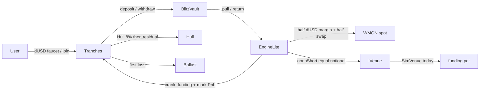

# Vessel

**The dollar leverage pays for.** Delta-neutral tranche yield on Monad.

**Unaudited. Demo dollars (dUSD) have no value. Do not deposit real money.**


| Surface | URL |
| --- | --- |
| Landing | [vessel.wtf](https://vessel.wtf) |
| Docs | [docs.vessel.wtf](https://docs.vessel.wtf) |
| **Testnet app (live)** | **[testnet.vessel.wtf](https://testnet.vessel.wtf)** · mirror [vessel-testnet.vercel.app](https://vessel-testnet.vercel.app) |
| Public status | [testnet.vessel.wtf/status](https://testnet.vessel.wtf/status) |
| Stats + keeper service | [vessel-service-production.up.railway.app/health](https://vessel-service-production.up.railway.app/health) |
| Explorer | [testnet.monadvision.com](https://testnet.monadvision.com) |
| Source | [github.com/Lemma-Development-Labs/vessel](https://github.com/Lemma-Development-Labs/vessel) |

### Run it yourself

Gas comes first: the dUSD faucet is itself a transaction, so with no MON you
cannot call it. This is the step that silently blocks newcomers.

1. **[Testnet MON for gas](https://faucet.monad.xyz)** — required for every transaction.
2. Open [testnet.vessel.wtf](https://testnet.vessel.wtf), connect a wallet, then **Get test dollars** for 100 dUSD.
3. Board a deck, then watch the hedge on [/transparency](https://testnet.vessel.wtf/transparency).

```bash
git clone https://github.com/Lemma-Development-Labs/vessel && cd vessel
forge test --root contracts          # 100 tests
cd app && pnpm i && pnpm test        # 37 tests
pnpm dev                             # http://localhost:3000
```

`app/.env.example` lists every variable. The app defaults to the **mock**
provider; set `NEXT_PUBLIC_USE_MOCK=0` for live chain reads. Check which one a
deployment is serving with `curl <url>/health` — it reports `provider`.

The landing site lives in a **separate** repo (`vessel-landing`). This repository is the protocol, the testnet app, and the keeper/stats service.

See [SECURITY.md](./SECURITY.md) and [HARDENING.md](./HARDENING.md). Share copy: [docs/announce.md](./docs/announce.md).

---

## Contents

1. [What it is](#what-it-is)
2. [What is real vs simulated](#what-is-real-vs-simulated)
3. [Architecture](#architecture)
4. [Tokenomics](#tokenomics)
5. [Live testnet (10143)](#live-testnet-10143)
6. [What we use and how](#what-we-use-and-how)
7. [Repository](#repository)
8. [Quickstart](#quickstart)
9. [How to test](#how-to-test)
10. [Local Anvil](#local-anvil)
11. [Testnet deploy](#testnet-deploy)
12. [App](#app)
13. [Keeper / stats](#keepers--stats)
14. [Using the product](#demo-script)
15. [The honest gap](#the-honest-gap)

---

## What it is

Vessel is a **two-tranche** machine over a dUSD vault:

- Users faucet **DemoUSD** (6 decimals, valueless).
- They join **Hull** (senior, 8% target) or **Ballast** (first loss, ≥ 20% of deck TVL).
- **BlitzVault** (ERC-4626) holds the cash. 90% is deployable; 10% stays idle.
- **EngineLite** pulls deployable idle, swaps half to WMON, opens an equal-notional short on `IVenue`, keeps half as margin.
- Anyone can **crank**. Funding + marked spot PnL become `grossYield`. **Tranches.settle** runs the waterfall.
- Conservation (every successful settle):

  `ΔhullNAV + ΔbalNAV + Δreserve + Δtreasury == grossYield`

Negative yield eats Ballast, then reserve. If both would be exhausted the crank reverts `HullImpairment()` — v0 does not silently haircut Hull.

---

## What is real vs simulated

| Leg | Status |
| --- | --- |
| Vault + Hull / Ballast + waterfall `settle` | **On-chain and real.** Conservation identity is tested and proven in live e2e. |
| Spot swap (`EngineLite._swap`) | **UniswapV2-shaped** on-chain call: `getAmountsOut`, 2% slippage (`SLIPPAGE_BPS = 200`), `deadline = now + 300s`. |
| Router / WMON on **this** testnet | **MockRouter + MockWMON** (1:1 6dec ↔ 18dec). Engine `router()` is `0x4D06…9e33`, not Puddle. There is no DemoUSD/WMON pool on Puddle yet. Canonical Puddle / WMON live in `ADDRESSES.json` `refs` for a later swap-in. |
| Short-leg funding | **Simulated.** `SimVenue` implements `IVenue`. `isSimulated() == true`. Seeded pot; empty pot reverts `InsufficientPot`. |
| Perp venue | `venues/PerplVenue.stub.sol` — compiles, every mutative call reverts `NotImplemented()`. Swap-in = one contract. See [PerplFoundation/api-docs](https://github.com/PerplFoundation/api-docs). |

Guardian can **only pause**. It cannot move funds or change params. There is **no privileged mint** (dUSD faucet is 100 / hour, lifetime 1,000 per address).

**Spot mark:** EngineLite marks WMON from `router.getAmountsOut` (pool mid). That price is manipulable. Per-crank spot PnL is capped at **±5%** of the last marked spot value (`SPOT_PNL_CAP_BPS = 500`). The real fix is a TWAP/oracle.

---

## Architecture



### Contracts

| Contract | Role |
| --- | --- |
| `DemoUSD` | 6-dec faucet token. 100 dUSD / hour, 1,000 lifetime cap. No admin mint. |
| `Guardian` | Ownable pause. Pause-only. |
| `BlitzVault` | ERC-4626 over dUSD. `DEPLOYABLE_BPS = 9000`. `deposit`/`mint` restricted to `Tranches`; previews open. Dead shares: 100 dUSD to `dEaD` via one-shot `seedDeadShares()`. `_decimalsOffset() = 6`. |
| `Tranches` | Join/exit Hull & Ballast. `settle(grossYield)` waterfall. |
| `TrancheToken` | `HULL` / `BAL` ERC-20s minted by Tranches. |
| `EngineLite` | Wire-once. `deployLiquidity` / `crank` / `unwind`. Permissionless crank. |
| `SimVenue` | Simulated funding market. Owner sets `fundingRateBps`. |
| `PerplVenue` | Stub for the live perp. |
| `MockWMON` / `MockRouter` | Sim-deploy spot leg. Not Puddle. |

`pnpm sync` copies ABIs into `app/lib/abis/` and writes `app/lib/addresses.ts` from [`ADDRESSES.json`](./ADDRESSES.json).

---

## Tokenomics

| Constant | Value | Meaning |
| --- | --- | --- |
| `HULL_RATE_BPS` | 800 | Hull senior coupon, 8% annualized |
| `FEE_BPS` | 1000 | 10% of **positive** gross, ceiled |
| `RESERVE_TARGET_BPS` | 200 | Reserve target 2% of user TVL |
| `THETA_MIN_BPS` | 2000 | Ballast ≥ 20% of deck TVL (exits that **improve** the ratio always allowed) |
| `YEAR` | 365 days | Accrual denominator |
| `MIN_JOIN` | 1e6 | 1 dUSD minimum join |
| `MAX_YIELD_BPS` | 5000 | `\|G\|` > 50% of hull+bal+reserve reverts `ImplausibleYield` |
| `DEPLOYABLE_BPS` | 9000 | Engine may pull 90% of vault assets |
| `SLIPPAGE_BPS` | 200 | 2% off `getAmountsOut` |
| `SWAP_DEADLINE` | 300 | seconds |
| `SPOT_PNL_CAP_BPS` | 500 | ±5% of last spot mark per crank |

Rounding always favors protocol + senior: mint/burn floor, Hull accrual floor, fee ceil, losses vs Ballast take full wei.

---

## Live testnet (10143)

Broadcast **2026-08-29**, `deployedBlock` **57874280**. Deployer `0x85Fe6D9399EA584Ba5344b8d21e27137adbB5738`. Sourcify (`solc 0.8.24`, optimizer 200, via-ir).

Explorer: [MonadVision testnet](https://testnet.monadvision.com). RPC: `https://testnet-rpc.monad.xyz`.

### Protocol

| Contract | Address | Explorer |
| --- | --- | --- |
| DemoUSD | `0x66B5A41466b1Ab2dE34Bf3834b26F99bA4f52e05` | [link](https://testnet.monadvision.com/address/0x66B5A41466b1Ab2dE34Bf3834b26F99bA4f52e05) |
| Guardian | `0x150e153D5aB4683EC576bC1F68b7839D86751208` | [link](https://testnet.monadvision.com/address/0x150e153D5aB4683EC576bC1F68b7839D86751208) |
| BlitzVault | `0xE1c3aBAd2789aC170833d9E9bd72E706284a70c5` | [link](https://testnet.monadvision.com/address/0xE1c3aBAd2789aC170833d9E9bd72E706284a70c5) |
| Tranches | `0xdb4666c3F187e73795bcF9Cfb3a6D64A875EF842` | [link](https://testnet.monadvision.com/address/0xdb4666c3F187e73795bcF9Cfb3a6D64A875EF842) |
| Hull | `0xC053Fc6968BAd0FB03094E002a4F4EC74a746f12` | [link](https://testnet.monadvision.com/address/0xC053Fc6968BAd0FB03094E002a4F4EC74a746f12) |
| Ballast | `0x074207acEf2f60a6B1B86a885D2fF893927109A1` | [link](https://testnet.monadvision.com/address/0x074207acEf2f60a6B1B86a885D2fF893927109A1) |
| SimVenue | `0xAbE34e4919e7Ffd5C87D5B62d35f7E7Bb4e50FD7` | [link](https://testnet.monadvision.com/address/0xAbE34e4919e7Ffd5C87D5B62d35f7E7Bb4e50FD7) |
| PerplVenue (stub) | `0xaf1C0BdEaF91273E18a80bF80afD8A5C6d497C21` | [link](https://testnet.monadvision.com/address/0xaf1C0BdEaF91273E18a80bF80afD8A5C6d497C21) |
| EngineLite | `0xDE65E58df3e3da55DD3c6e107E30E1655Fb5fC85` | [link](https://testnet.monadvision.com/address/0xDE65E58df3e3da55DD3c6e107E30E1655Fb5fC85) |
| MockWMON | `0x17141F36c4401C6184143250827713b26c3E964F` | [link](https://testnet.monadvision.com/address/0x17141F36c4401C6184143250827713b26c3E964F) |
| MockRouter | `0x23389cA2fbf11f9D0159EF2F80A963E710c5F97C` | [link](https://testnet.monadvision.com/address/0x23389cA2fbf11f9D0159EF2F80A963E710c5F97C) |

All eleven are **Sourcify-verified `exact_match`** on chain 10143, checked
2026-08-29 — the app reads that state per contract from a generated manifest
(`app/lib/verification.ts`) rather than asserting it.

Deployed at block **57918591**.

### Roles (addresses, never keys)

| Role | Address | Notes |
| --- | --- | --- |
| Protocol owner | [`0x85Fe6D9399EA584Ba5344b8d21e27137adbB5738`](https://testnet.monadvision.com/address/0x85Fe6D9399EA584Ba5344b8d21e27137adbB5738) | **2-of-3 Safe** (v1.4.1). Holds `Guardian.owner`, `Tranches.treasury`, `SimVenue.owner`. See the honesty note below. |
| Deployer | `0x830C52EAda6fcE4D72Ca24F25D84d163aDCf581e` | Throwaway. Every power it had (`setEngine`, `setTranches`, `seedDeadShares`, `wire`) is single-use and already spent. |
| Seeder | `0x94555bff001A4Eea5B488f3591df039Be5373e46` | Seeded the SimVenue funding pot. |
| Keeper (gas only) | `0x60A7cF428BD62B127F5f2BA84301e6251C92964C` | Calls `crank()`, which is permissionless. Holds no dUSD and no approvals. |

> **On the Safe, honestly.** All three signer keys were generated on one machine,
> so today it gives you a 1-of-1 with a multisig's shape — not the security
> property "2-of-3" usually implies. It was still worth setting at deploy time:
> `Tranches.treasury` and `SimVenue.owner` are `immutable`, so pointing them at a
> Safe means the signers can be replaced later with one Safe transaction, while
> pointing them at an EOA would have meant redeploying the whole protocol again.

### Deprecated — compromised deployer key

The deployment below is **superseded and must not be used**. Its `deployer` key
was exposed on 2026-08-29, and that key held `Guardian.owner`, `SimVenue.owner`
and the `Tranches` treasury. Whoever holds it can pause those contracts
indefinitely and drive `setFundingRateBps` to −100%. `deployer` is `immutable`
there, so the contracts cannot be secured — only abandoned.

It also predates the dead-share yield fix, so it leaks a share of every yield
credit into an unredeemable position.

| Contract | Deprecated address |
| --- | --- |
| DemoUSD | `0x7e1Eca4BD693Ca17ADEC1C21cb8a8Cc3edAF6Acc` |
| Guardian | `0x9f47CA6E0A5B4786362cdBfcCED3710Ea518aa4E` |
| BlitzVault | `0x4E3C935c69FE55D2A21F1CaB00A95c75F4F85823` |
| Tranches | `0x9350A360b01bA4F87Df1164da97Dcc066c37986d` |
| Hull / Ballast | `0xb4C08A9F27a0F64e571f57E633073b4D66680D0d` / `0x4b37a2c7EeA338832e5F41F75A3F90DC3DffFB33` |
| SimVenue | `0x7E305794712DB9AdBfbe4be5E6CD43C94f7D1bf2` |
| EngineLite | `0x9FB500D00618C27088c439EdE6EED2c6FeB02455` |
| Compromised deployer EOA | `0x4307C72a92063df4fa189c9e9621b741d457be7C` |

A forensic sweep found the key was never committed, never in a CI log and never
in the deployed bundle — it reached one chat transcript and nothing else. The
evidence is in [`OPS.md`](OPS.md) §0. It is still treated as compromised.

Monad **mainnet (143)** is **not** deployed.

### Canonical refs (not wired as the spot pair)

| Ref | Value |
| --- | --- |
| Testnet RPC | `https://testnet-rpc.monad.xyz` |
| Mainnet RPC | `https://rpc.monad.xyz` |
| WMON testnet | `0xFb8bf4c1CC7a94c73D209a149eA2AbEa852BC541` |
| WMON mainnet | `0x3bd359C1119dA7Da1D913D1C4D2B7c461115433A` |
| Puddle UniswapV2Router02 | `0x430c23895c8D44883526e3E0B09327dAD8766660` |

More: [docs/ADDRESSES.md](./docs/ADDRESSES.md) · [FACTS.md](./FACTS.md) · [docs/proof-of-hedge.md](./docs/proof-of-hedge.md).

---

## What we use and how

| Piece | How Vessel uses it |
| --- | --- |
| **Monad** | Settlement chain. Testnet `10143`, mainnet `143`. Cancun EVM. |
| **Solidity 0.8.24** | `contracts/foundry.toml`: optimizer **200**, **via-ir**, `use_literal_content` for Sourcify. |
| **Foundry** | Compile, test, fuzz, snapshot, script deploy, verify. |
| **OpenZeppelin** | ERC-20, ERC-4626, Ownable, ReentrancyGuard, SafeERC20. |
| **Sourcify** | `https://sourcify-api-monad.blockvision.org/` — verified bytecode ↔ this repo. |
| **Next.js 16 / React 19 / Tailwind 4** | `app/` — Deposit, Portfolio, Transparency. |
| **wagmi + viem** | Wallet + reads/writes when `NEXT_PUBLIC_USE_MOCK=0`. |
| **TanStack Query** | Polling deck stats, engine, waterfall. |
| **Fastify + viem** | `vessel-service/` — permissionless crank loop, Waterfall indexer, GET `/stats` `/waterfall` `/health`. |
| **GitHub Actions** | fmt, 25k fuzz, gas snapshot ±10%, sizes, coverage ≥95%, slither `--fail-none`, app build, secrets scan. |

Spot **interface** is UniswapV2 (`IUniswapV2Router02`) so a later `wire` can point at Puddle without changing EngineLite. Today the live `router()` is MockRouter.

---

## Repository

```
contracts/          Foundry protocol (src / test / script)
app/                Next.js — /deposit · /portfolio · /transparency · /demo
vessel-service/     Keeper + indexer + stats API (Railway-shaped)
scripts/            sync.mjs · e2e.ts · keeper.ts · check-secrets.mjs
ADDRESSES.json      Single source of truth after deploy
HARDENING.md        Security sweep (not an audit)
SECURITY.md         Disclosure
docs/               ADDRESSES, announce, e2e table, proof-of-hedge
```

CI: [`.github/workflows/ci.yml`](./.github/workflows/ci.yml). Coverage on `src/` excluding Perpl stub: **482/483 = 99.79%** ([contracts/coverage-report.md](./contracts/coverage-report.md)).

---

## Quickstart

Need: [Foundry](https://book.getfoundry.sh/getting-started/installation), Node 20+, [pnpm](https://pnpm.io).

```bash
git clone https://github.com/Lemma-Development-Labs/vessel.git
cd vessel
pnpm install
cd app && pnpm install && cd ..
cd vessel-service && pnpm install && cd ..
```

### Env

| File | Vars |
| --- | --- |
| `contracts/.env` | `MONAD_TESTNET_RPC` · `MONAD_MAINNET_RPC` · `DEPLOYER_PK` · `SEEDER_PK` (**must ≠** deployer) |
| `app/.env.local` | copy `app/.env.example`. `NEXT_PUBLIC_USE_MOCK=1` stage (no wallet). `=0` against chain. RPC CSV + fallback. Chain 10143 or Anvil 31337. Optional `NEXT_PUBLIC_STATS_URL`. |
| `.env` | `RPC_URL` · `KEEPER_PK` (gas only, ≠ deployer) · `E2E_PK` (burner, ≠ both) · `CRANK_INTERVAL_SEC=300` · `DEPLOYER_PK` (SetRate / e2e only) |

```bash
cp contracts/.env.example contracts/.env
cp app/.env.example app/.env.local
cp .env.example .env
```

Never commit private keys. `scripts/check-secrets.mjs` fails CI on unexpected `0x`+64-hex in tracked source.

---

## How to test

Tests must be green before any new deploy.

### Contracts (Foundry)

```bash
cd contracts
forge fmt --check
forge test -vvv --offline
forge test --offline --fuzz-runs 10000          # local
FOUNDRY_PROFILE=ci forge test --offline --fuzz-runs 25000
forge snapshot --check --tolerance 10 --offline --no-match-test 'testFuzz' --no-match-path 'test/fork/*'
```

From repo root:

```bash
pnpm test              # forge test --offline
pnpm test:fuzz
pnpm test:ci           # 25k fuzz
pnpm secrets
```

Layout under `contracts/test/`:

- `unit/` — DemoUSD, vault, Tranches, Engine, venue, pause, rounding, reentrancy, inflation, edges
- `integration/` — full cycle
- `invariant/` — conservation fuzz
- `fork/` — skipped unless `ADDRESSES.json` is 10143 with code

### Live / Anvil e2e

`pnpm e2e` (`scripts/e2e.ts`) against `ADDRESSES.json`:

1. Preflight `getCode` on every address
2. Faucet +100 dUSD
3. Join Ballast 60 / Hull 40, subordination ≥ 20%
4. `deployLiquidity` — spot WMON > 0, short notional > 0, `|netDeltaBps| ≤ 100`
5. Wait 60s (Anvil: `evm_increaseTime(60)`) then crank — conservation identity
6. `setFundingRateBps(-2400)`, wait, crank — Hull NAV unchanged, Ballast takes the hole
7. Partial Ballast exit (floor holds)
8. `unwind` then full Hull exit = principal + accrued

Last **10143** run: [docs/e2e-last-run.md](./docs/e2e-last-run.md) and the table in [HARDENING.md](./HARDENING.md). Needs `E2E_PK` ≠ deployer, funded with native, and a faucet-fresh burner.

### App

```bash
cd app
pnpm install
pnpm lint
pnpm build
```

Stage UI without a wallet: `NEXT_PUBLIC_USE_MOCK=1` (default in `.env.example`). Demo query: `?demo=empty|negative|disconnected|floor|boarded|impair|wrongnet|paused`. Route `/demo` lists states.

### Proof of hedge (read-only)

```bash
export RPC=https://testnet-rpc.monad.xyz
export TRANCHES=0xdb4666c3F187e73795bcF9Cfb3a6D64A875EF842
export VAULT=0xE1c3aBAd2789aC170833d9E9bd72E706284a70c5
export ENGINE=0xDE65E58df3e3da55DD3c6e107E30E1655Fb5fC85
cast call $TRANCHES "deckStats()" --rpc-url $RPC
cast call $VAULT "totalAssets()(uint256)" --rpc-url $RPC
cast call $ENGINE "netDeltaBps()(int256)" --rpc-url $RPC
```

See [docs/proof-of-hedge.md](./docs/proof-of-hedge.md).

---

## Local Anvil

```bash
anvil --host 0.0.0.0 --with-gas-price 1gwei
# other terminal — Foundry account 0 as deployer; Anvil account 1 must be SEEDER_PK
cd contracts
forge script script/Deploy.s.sol --rpc-url http://127.0.0.1:8545 --broadcast \
  --private-key 0xac0974bec39a17e36ba4a6b4d238ff944bacb478cbed5efcae784d7bf4f2ff80
cd .. && pnpm sync
# app/.env.local → NEXT_PUBLIC_USE_MOCK=0  NEXT_PUBLIC_CHAIN_ID=31337  NEXT_PUBLIC_RPC=http://127.0.0.1:8545
cd app && pnpm dev
```

That **overwrites** `ADDRESSES.json`. Snapshot the testnet file first if you need it.

SimVenue is seeded with **100 dUSD** (one faucet from `SEEDER_PK`). Extra seed after the 1-hour faucet cooldown.

---

## Testnet deploy

```bash
cd contracts
source .env
forge test --offline --fuzz-runs 10000
forge script script/Deploy.s.sol --rpc-url $MONAD_TESTNET_RPC --broadcast --private-key $DEPLOYER_PK --slow
```

`SEEDER_PK` must differ from `DEPLOYER_PK`. Verify ([guide](https://docs.monad.xyz/guides/verify-smart-contract)):

```bash
forge verify-contract <ADDR> src/DemoUSD.sol:DemoUSD --chain 10143 \
  --verifier sourcify --verifier-url https://sourcify-api-monad.blockvision.org/ \
  --via-ir --num-of-optimizations 200 --compiler-version v0.8.24 --watch
```

Repeat for Guardian, BlitzVault, Tranches, TrancheToken (Hull/Ballast), SimVenue, PerplVenue, EngineLite, MockWMON, MockRouter. Constructor args: `cast abi-encode`.

```bash
cd .. && pnpm sync
```

Mainnet (143): same script, `MONAD_MAINNET_RPC`, 2–5 real MON. Snapshot testnet `ADDRESSES.json` first.

---

## App

Testnet UI: [testnet.vessel.wtf](https://testnet.vessel.wtf).

| Route | Screen |
| --- | --- |
| `/` | Redirects to `/deposit` |
| `/deposit` | Faucet, join Hull / Ballast, deploy hedge |
| `/portfolio` | Positions, NAV, exits |
| `/transparency` | Hedge, crank, waterfall tape |
| `/demo` | Stage states |
| `/health` | Liveness |

`NEXT_PUBLIC_USE_MOCK=1` — `MockVesselProvider` (1.8s fake txs). `=0` — `ChainVesselProvider` (wagmi). Production build uses `app/.env.production` (`USE_MOCK=0`, chain 10143).

Stats: if `NEXT_PUBLIC_STATS_URL` is set, the app prefers `GET /waterfall` then falls back to `getLogs` from `deployedBlock`.

```bash
cd app && pnpm dev          # http://localhost:3000
pnpm build && pnpm start    # 0.0.0.0, honors $PORT
```

Design contract: [app/CLAUDE.md](./app/CLAUDE.md). Amber TESTNET banner, SIM VENUE chip, **unaudited** footer on every route.

---

## Keepers / stats

[`vessel-service/`](./vessel-service/) — Fastify on `0.0.0.0:$PORT`.

| Endpoint | |
| --- | --- |
| `GET /health` | liveness, last crank, keeper MON |
| `GET /stats` | TVL, subordination, net delta, venue |
| `GET /waterfall?limit=` | indexed `Waterfall` events |

CORS: `vessel.wtf`, `testnet.vessel.wtf`, `docs.vessel.wtf`, localhost:3000, `*.vercel.app`.

`crank()` is permissionless. The keeper key only spends its own MON. Preflight: chainId match, `getCode` on EngineLite, MON ≥ 0.5. Skip-reverts (`DtZero`, `Paused`, …) are not failures. Three unexpected failures → `process.exit(1)` (Railway `ON_FAILURE`).

```bash
cd vessel-service
cp .env.example .env
# RPC_URL, CHAIN_ID=10143, KEEPER_PK, ADDRESSES_JSON (full ADDRESSES.json blob)
pnpm dev
```

Root `pnpm keeper` runs `scripts/keeper.ts` against `app/lib/addresses.ts`.

---

## Demo script

1. Open [testnet.vessel.wtf](https://testnet.vessel.wtf) (or `USE_MOCK=1` locally).
2. Connect a Monad testnet wallet (chain 10143). **Faucet** 100 dUSD.
3. **Join Ballast** first (20% floor), then **Join Hull**.
4. **Deploy hedge** — engine pulls 90%, swaps half to WMON, opens an equal short.
5. Wait ≥ 1s (live: 60s between cranks), **Crank**. Waterfall rows come from the `Waterfall` event.
6. **Exit**. Large exits on a live book may need `unwind()` so the vault has idle cash (10% buffer otherwise).

Bad-day (Ballast takes the hit):

```bash
cd contracts
SIM_VENUE=0xAbE34e4919e7Ffd5C87D5B62d35f7E7Bb4e50FD7 RATE_BPS=-1200 \
  forge script script/SetRate.s.sol --rpc-url https://testnet-rpc.monad.xyz --broadcast --private-key $DEPLOYER_PK
# then one crank
```

Stage wallets after each has faucet'd:

```bash
DUSD=… TRANCHES=… ALICE_PK=… BOB_PK=… forge script script/Seed.s.sol --broadcast --rpc-url $RPC
```

---

## The honest gap

External security audit (the hard gate) · real venue: PerplVenue against Perpl’s order/margin/liquidation surface · real USDC and removal of DemoUSD/faucet · **Puddle** (or another real pool) wired as `router`/`wmon` · TWAP/oracle for the spot mark · timelock + multisig replacing single-key ownership; guardian policy published · deposit caps + progressive limits · monitoring/alerting beyond logs · legal review before vUSD.

Until every line here is crossed, the banner stays amber and the first word stays **unaudited**.

Known v0 limits (also in SECURITY.md): the dead-share seed strands a share of every yield credit, so a full final exit can revert; `settle` can book NAV above vault cash until `unwind`; SimVenue not Perpl; single-key owner. Share issuance is no longer public — `deposit`/`mint` are restricted to `Tranches`.

License: MIT.
