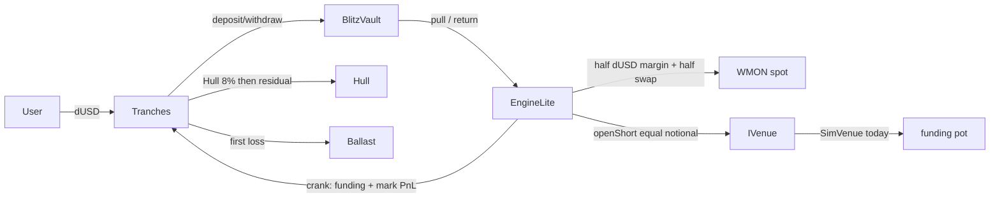

# Vessel

**The dollar leverage pays for.** Delta-neutral tranche yield on Monad.

**Unaudited.**


Live: [vessel.wtf](https://vessel.wtf) · [testnet.vessel.wtf](https://testnet.vessel.wtf) · [docs.vessel.wtf](https://docs.vessel.wtf)

**Unaudited. Demo dollars (dUSD) have no value.** See [SECURITY.md](./SECURITY.md) and [HARDENING.md](./HARDENING.md).

Copy-paste announce (thread; [full notes](./docs/announce.md)):

```
Contracts are live on @monad testnet. Verified, source published, read them yourself.

VESSEL — long spot, short the perp, funding streams through a two-tranche waterfall.

https://github.com/Lemma-Development-Labs/vessel

@monad_dev @geeky_kartikey
```

```
Vault    0x4E3C935c69FE55D2A21F1CaB00A95c75F4F85823
Tranches 0x9350A360b01bA4F87Df1164da97Dcc066c37986d
Engine   0x9FB500D00618C27088c439EdE6EED2c6FeB02455

https://testnet.monadvision.com/address/0x9FB500D00618C27088c439EdE6EED2c6FeB02455
```

---

## What is real vs simulated

| Leg | Status |
| --- | --- |
| Spot (dUSD ↔ WMON via the wired router) | **On-chain.** Accounting is real. On a fresh DemoUSD deploy there is no Puddle pool, so the script wires **MockRouter + MockWMON** (1:1 6dec↔18dec). Canonical Puddle / WMON addresses live in `ADDRESSES.json` `refs` for the swap-in. |
| Vault (ERC-4626) + Hull / Ballast + waterfall `settle` | **On-chain and real.** Conservation: `ΔhullNAV + ΔbalNAV + Δreserve + Δtreasury == grossYield`. |
| Short-leg funding market | **Simulated.** `SimVenue` implements `IVenue` so hedge accounting is demonstrable today. `isSimulated() == true`. |
| Perp venue | `venues/PerplVenue.stub.sol` — compiles, reverts `NotImplemented()`. Swap = one contract. See [PerplFoundation/api-docs](https://github.com/PerplFoundation/api-docs). |

Guardian can **only pause**. It cannot move funds or change params. There is **no privileged mint** anywhere (dUSD faucet is 100 / hour, lifetime 1,000 per address).

**Oracle / spot mark (A6):** EngineLite marks the WMON spot leg from `router.getAmountsOut` (pool mid). That price is manipulable. For v0 this misprices `grossYield` between cranks. Mitigation: per-crank spot PnL is capped at **±5%** of the last marked spot value (`EngineLite.SPOT_PNL_CAP_BPS = 500`). The real fix is a TWAP/oracle — listed in the honest gap below and in [SECURITY.md](./SECURITY.md).

---

## Architecture



Hull is senior at `HULL_RATE_BPS = 800` (8% annualized). Fee `FEE_BPS = 1000` (10% of positive gross). Reserve target `200` bps of TVL. Subordination floor: Ballast ≥ 20% of deck TVL (`THETA_MIN_BPS = 2000`), except exits that **improve** the ratio. Negative yield eats Ballast, then reserve; if both would be exhausted the crank reverts `HullImpairment()` — v0 does not silently haircut Hull.

---

## Addresses

Source of truth: [`ADDRESSES.json`](./ADDRESSES.json) (deploy writes it; `pnpm sync` copies ABIs + generates `app/lib/addresses.ts`).

Explorer: testnet [MonadVision](https://testnet.monadvision.com) · mainnet [MonadVision](https://monadvision.com).

| Contract | Testnet (10143) | Mainnet (143) |
| --- | --- | --- |
| DemoUSD | [`0x7e1Eca4BD693Ca17ADEC1C21cb8a8Cc3edAF6Acc`](https://testnet.monadvision.com/address/0x7e1Eca4BD693Ca17ADEC1C21cb8a8Cc3edAF6Acc) | — |
| Guardian | [`0x9f47CA6E0A5B4786362cdBfcCED3710Ea518aa4E`](https://testnet.monadvision.com/address/0x9f47CA6E0A5B4786362cdBfcCED3710Ea518aa4E) | — |
| BlitzVault | [`0x4E3C935c69FE55D2A21F1CaB00A95c75F4F85823`](https://testnet.monadvision.com/address/0x4E3C935c69FE55D2A21F1CaB00A95c75F4F85823) | — |
| Tranches | [`0x9350A360b01bA4F87Df1164da97Dcc066c37986d`](https://testnet.monadvision.com/address/0x9350A360b01bA4F87Df1164da97Dcc066c37986d) | — |
| Hull | [`0xb4C08A9F27a0F64e571f57E633073b4D66680D0d`](https://testnet.monadvision.com/address/0xb4C08A9F27a0F64e571f57E633073b4D66680D0d) | — |
| Ballast | [`0x4b37a2c7EeA338832e5F41F75A3F90DC3DffFB33`](https://testnet.monadvision.com/address/0x4b37a2c7EeA338832e5F41F75A3F90DC3DffFB33) | — |
| SimVenue | [`0x7E305794712DB9AdBfbe4be5E6CD43C94f7D1bf2`](https://testnet.monadvision.com/address/0x7E305794712DB9AdBfbe4be5E6CD43C94f7D1bf2) | — |
| PerplVenue (stub) | [`0x4b710a0e4E7767bE65a4821f9b4983Ef10B8E26e`](https://testnet.monadvision.com/address/0x4b710a0e4E7767bE65a4821f9b4983Ef10B8E26e) | — |
| EngineLite | [`0x9FB500D00618C27088c439EdE6EED2c6FeB02455`](https://testnet.monadvision.com/address/0x9FB500D00618C27088c439EdE6EED2c6FeB02455) | — |
| MockWMON | [`0x4582d715f72221e70A64Af85DF8D9060Be0e1261`](https://testnet.monadvision.com/address/0x4582d715f72221e70A64Af85DF8D9060Be0e1261) | — |
| MockRouter | [`0x4D06f69257951B4d5FA4F9D2BF43950d373D9e33`](https://testnet.monadvision.com/address/0x4D06f69257951B4d5FA4F9D2BF43950d373D9e33) | — |

Broadcast 2026-08-29, `deployedBlock` **57874280**, deployer `0x4307C72a92063df4fa189c9e9621b741d457be7C`. Sourcify (`solc 0.8.24`, optimizer 200, via-ir) — MonadVision ticks once the verifier job lands. Re-run Deploy locally for Anvil (`chainId: 31337`). See [docs/ADDRESSES.md](./docs/ADDRESSES.md) and [FACTS.md](./FACTS.md).

Canonical refs (never guessed — from [docs.monad.xyz/developer-essentials/network-information](https://docs.monad.xyz/developer-essentials/network-information) and Puddle):

| Ref | Address / URL |
| --- | --- |
| Testnet RPC | `https://testnet-rpc.monad.xyz` |
| Mainnet RPC | `https://rpc.monad.xyz` |
| WMON testnet | `0xFb8bf4c1CC7a94c73D209a149eA2AbEa852BC541` |
| WMON mainnet | `0x3bd359C1119dA7Da1D913D1C4D2B7c461115433A` |
| Puddle UniswapV2Router02 | `0x430c23895c8D44883526e3E0B09327dAD8766660` |

---

## Quickstart

Need: [Foundry](https://book.getfoundry.sh/getting-started/installation), Node 20+, [pnpm](https://pnpm.io).

```bash
git clone https://github.com/Lemma-Development-Labs/vessel.git
cd vessel
pnpm install
cd app && pnpm install && cd ..
```

### Env

| File | Vars |
| --- | --- |
| `contracts/.env` | `MONAD_TESTNET_RPC` · `MONAD_MAINNET_RPC` · `DEPLOYER_PK` · `SEEDER_PK` (must ≠ deployer) |
| `app/.env.local` | copy `app/.env.example`. `NEXT_PUBLIC_USE_MOCK=1` for stage; `0` after deploy. `NEXT_PUBLIC_RPC` (CSV ok) + `NEXT_PUBLIC_RPC_FALLBACK`. Chain 10143 or Anvil 31337. |
| `.env` (keeper / e2e) | `RPC_URL` · `KEEPER_PK` (gas-only, ≠ deployer) · `E2E_PK` (burner, ≠ both) · `CRANK_INTERVAL_SEC=300` · `DEPLOYER_PK` (SetRate only) |

```bash
cp contracts/.env.example contracts/.env
cp app/.env.example app/.env.local
cp .env.example .env
```

### Tests (must be green before any deploy)

```bash
cd contracts
forge test -vvv --offline
forge test --offline --fuzz-runs 10000          # local
FOUNDRY_PROFILE=ci forge test --offline --fuzz-runs 25000
```

`pnpm e2e` proves a live (or Anvil) deploy with assertions. See [HARDENING.md](./HARDENING.md).

### Local machine (Anvil)

```bash
anvil --host 0.0.0.0
# other terminal
cd contracts
forge script script/Deploy.s.sol --rpc-url http://127.0.0.1:8545 --broadcast --private-key 0xac0974bec39a17e36ba4a6b4d238ff944bacb478cbed5efcae784d7bf4f2ff80
cd .. && pnpm sync
# app/.env.local → NEXT_PUBLIC_USE_MOCK=0  NEXT_PUBLIC_CHAIN_ID=31337  NEXT_PUBLIC_RPC=http://127.0.0.1:8545
cd app && pnpm dev
```

SimVenue is seeded with **100 dUSD** (one faucet). The token has no admin mint and a 1,000 lifetime cap; extra venue seed after the 1-hour cooldown.

### Testnet deploy + verify

```bash
cd contracts
source .env
forge test --offline --fuzz-runs 10000
forge script script/Deploy.s.sol --rpc-url $MONAD_TESTNET_RPC --broadcast --private-key $DEPLOYER_PK
```

Verify every contract ([guide](https://docs.monad.xyz/guides/verify-smart-contract)):

```bash
# Sourcify (Monad)
forge verify-contract <ADDR> src/DemoUSD.sol:DemoUSD --chain 10143 \
  --verifier sourcify --verifier-url https://sourcify-api-monad.blockvision.org/
# repeat for Guardian, BlitzVault, Tranches, SimVenue, PerplVenue, EngineLite, MockWMON, MockRouter
```

```bash
cd .. && pnpm sync
# app/.env.local: NEXT_PUBLIC_USE_MOCK=0  NEXT_PUBLIC_CHAIN_ID=10143
cd app && pnpm dev
```

Mainnet mirror (chain 143): same script with `MONAD_MAINNET_RPC`. Deployer needs 2–5 real MON. `ADDRESSES.json` is a single object — re-run deploy on mainnet overwrites unless you snapshot the testnet file first.

### App + keeper

```bash
cd app && pnpm dev          # http://localhost:3000  (USE_MOCK=1 works with no wallet)
# production-style:
pnpm build && pnpm start  # binds 0.0.0.0, honors $PORT

# from repo root, after funding the keeper (≥ 0.5 native)
pnpm keeper               # or: node --env-file=.env --import tsx scripts/keeper.ts
```

`crank()` is permissionless. The keeper key cannot pause, mint, or move user funds.

### Bad-day demo

```bash
cd contracts
SIM_VENUE=<from ADDRESSES.json> RATE_BPS=-1200 \
  forge script script/SetRate.s.sol --rpc-url $RPC --broadcast --private-key $DEPLOYER_PK
# then one crank — Ballast (then reserve) drains on screen; HullImpairment if the hole is too big
```

Stage wallets (after each has faucet'd):

```bash
DUSD=… TRANCHES=… ALICE_PK=… BOB_PK=… forge script script/Seed.s.sol --broadcast --rpc-url $RPC
```

---

## Demo script (stage)

1. Open the app (`USE_MOCK=1` is enough for a dry run; `=0` on a fresh wallet for the real path).
2. **Faucet** 100 dUSD.
3. **Join Ballast** first (20% floor). Then **Join Hull**.
4. **Deploy hedge** (engine pulls 90% of vault assets, swaps half to WMON, opens an equal short).
5. Wait ≥ 1s, **Crank** — waterfall animates from the `Waterfall` event fields (gross, fee, toReserve, toTreasury, hullAccrual, toBallast, fromBallast, fromReserve).
6. **Exit**. On a live book, large exits may need `unwind()` first so the vault has idle cash (10% buffer otherwise).

Keeper: leave it running; the waterfall list is the auto-crank tape.

---

## Repo

```
contracts/        Foundry ^0.8.24
app/              Next.js app — /deposit · /portfolio · /transparency
                  MockProvider (USE_MOCK=1) or ChainProvider (USE_MOCK=0)
vessel-service/   Railway keeper + indexer + GET /stats · /waterfall · /health
scripts/          sync.mjs · keeper.ts · e2e.ts
ADDRESSES.json    deploy output (single source for app, docs, service)
HARDENING.md      security sweep (not an audit)
SECURITY.md       unaudited disclosure
```

App routes: [testnet.vessel.wtf](https://testnet.vessel.wtf) — Deposit / Portfolio / Transparency. Stage fallback: `NEXT_PUBLIC_USE_MOCK=1`. Demo states: `/demo` and `?demo=empty|negative|disconnected|floor`.

`pnpm sync` (alias `pnpm sync-abis`) copies ABIs into `app/lib/abis/` and regenerates `app/lib/addresses.ts`.

Keeper/stats: see [vessel-service/README.md](./vessel-service/README.md). CORS allows vessel.wtf, testnet.vessel.wtf, docs.vessel.wtf, and `*.vercel.app`. The app prefers `NEXT_PUBLIC_STATS_URL/waterfall` and falls back to `getLogs`.

## The honest gap

External security audit (the hard gate) · real venue: PerplVenue against Perpl's order/margin/liquidation surface · real USDC and removal of DemoUSD/faucet · TWAP/oracle pricing for the spot mark (A6) · timelock + multisig replacing single-key ownership; guardian policy published · deposit caps + progressive limits · monitoring/alerting beyond logs · legal review before vUSD.

Until every line here is crossed, the banner stays amber and the first word stays **unaudited**.

License: MIT.
