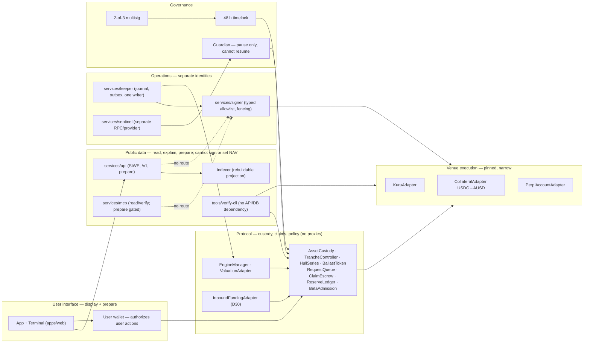
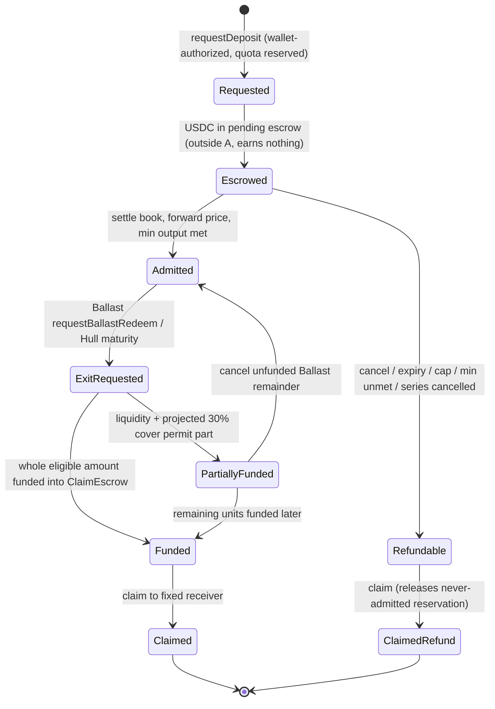
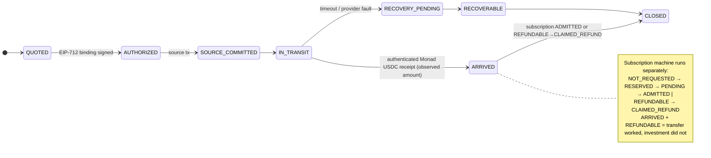

# ARCHITECTURE

Frozen in Session 1 (2026-09-23) per [spec/VESSEL_V1.md](spec/VESSEL_V1.md) §5.
Rule of the freeze: **keep the existing working stack where it already
satisfies the trust boundaries; do not rewrite for folder layout.**

## Stack (kept)

| Layer | Choice | Where |
|---|---|---|
| Contracts | Solidity 0.8.24 + Foundry (via-ir, optimizer 200) | `contracts/` |
| App | Next.js 16 / React 19 / Tailwind 4, wagmi + viem | `app/` (Vercel) |
| Service | Fastify 5 + viem + Postgres (`pg`) | `vessel-service/` (Railway) |
| Shared schemas | TypeScript, `packages/domain` (new, Session 1) | `packages/domain/` |
| Indexing | Custom `eth_getLogs` poller (kept for now) | `vessel-service/src/indexer.ts` |
| CI | GitHub Actions: fuzz, gas, sizes, coverage, Slither, secrets | `.github/workflows/ci.yml` |

## Trust boundaries — current vs target

| Boundary | Authority (spec §5) | Today | Gap |
|---|---|---|---|
| User interface | display + prepare; wallet signs | app holds no secrets ✅ | transaction-intent module absent (S5) |
| Public data | read + explain; cannot set NAV or sign | API is read-only ✅ | **keeper key lives in the same vessel-service process/env as the public API** — split required (below) |
| Protocol | enforces assets, claims, permissions | contracts enforce waterfall + floor ✅ | v2 modules per D-register gaps |
| Venue execution | narrow pinned actions | SimVenue/MockRouter only | real adapters are Session 3, gated on G01–G04 |
| Operations | bounded policy + detection | crank keeper, log-only alerts | journal, signing broker, sentinel absent (S3/S7) |
| Governance | multisig + timelock + pause guardian | Safe 2-of-3 owner + pause-only Guardian ✅ (verified on chain) | no timelock; v0 params are constants so none needed yet — required for v2 configurable caps |

## Decisions frozen this session

1. **No root pnpm-workspace restructure.** `app/` and `vessel-service/` deploy
   standalone to Vercel and Railway with their own lockfiles. `packages/domain`
   is a standalone package; consumers adopt it the same way ABIs are adopted
   today (a `sync` step or a direct file dependency), until a deliberate
   workspace migration is scheduled with both deploy pipelines tested. This
   follows spec §5's "do not rewrite solely for a new folder layout".
2. **One schema source.** Shared types (evidence tags, environments, units,
   golden-vector shapes) live in `packages/domain` and nowhere else. UI must
   not re-implement economic math (COMMON.md); generated bindings for
   contracts stay ABI-derived via `pnpm sync`.
3. **Auth lives in vessel-service, reached same-origin.** SIWE endpoints are
   served by vessel-service (it owns Postgres) and proxied through Next.js
   rewrites under `/api/auth/*`, so cookies are first-party on the app domain.
   Design frozen in [AUTH.md](AUTH.md); implementation is the remaining
   Session 1 work item.
4. **Keeper/API split is scheduled, recorded as a current violation.** Today
   `KEEPER_PK` sits in the same Railway service as the public API. Acceptable
   only because the key is gas-only and `crank()` is permissionless; it must
   become a separate process/identity before any key with venue authority
   exists (Session 3 gate, spec §5/§22).
5. **Indexing stays on the custom poller until Session 4**, where Envio is
   evaluated against it. Whatever wins must adopt the canonical event identity
   (chainId, blockHash, txHash, logIndex) and finalized/reverted tracking
   (spec §12) — the current poller deduplicates more loosely.
6. **Landing page stays in its separate repo** (`vessel-landing`), per spec §5.

## Deployment topology (current)

```
browser ── testnet.vessel.wtf (Vercel, Next.js app; no secrets)
   │            │  rewrites /api/auth/* (planned)
   │            ▼
   │        vessel-service (Railway, Fastify): /live /health /stats /waterfall
   │            │  Postgres (Railway): waterfall_events, engine_snapshots, cursor
   │            │  keeper loop: EngineLite.crank() — gas-only key  ⚠ same process
   ▼            ▼
Monad testnet 10143 ── 11 contracts, owner = Safe 2-of-3 0xe4f2…0279
```

Mainnet (143): nothing deployed. Local: Anvil 31337 via `script/Deploy.s.sol`.

## Environments

Separate manifests and secrets per environment (spec §22): `ADDRESSES.json` is
the single testnet source of truth (synced into app/service); local Anvil
overwrites it — snapshot first (FACTS.md). Mainnet manifests do not exist and
must not be fabricated; mainnet manifest validation must fail if any
vUSD/svUSD artifact is present (D17).

## Target diagrams (v2)

Scoped to what the spec fixes; the prose in [spec/VESSEL_V1.md](spec/VESSEL_V1.md)
§5–§12 and [HANDBOOK_v4.md](HANDBOOK_v4.md) ch. 6 governs detail.

### Trust boundaries



### Native request lifecycle



### Inbound supported-chain route (D30)


